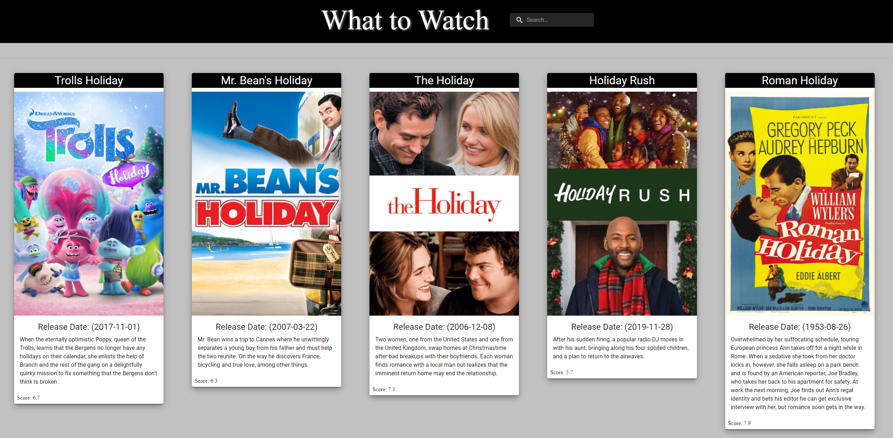

# Movie Search

[Repository Link](https://github.com/ElusiveSkies/movie-search)

[Deployed Link](https://ElusiveSkies.github.io/movie-search/))

## Table of Contents

- [Technology](#Technology)
- [Installation](#Installation)
- [Usage](#Usage)
- [License](#License)
- [Questions](#Questions)

## Description

```md
Allows the user to search for movies from TMDb
  ```

  ## Technology

  - Javascript
  - HTML
  - CSS
  - React
  - Material-UI
  - The Movie Database (TMDb) API

## Usage



## License

[](https://opensource.org/licenses/MIT)


## Questions

[Contact me](mailto:elusiveskies@gmail.com)

[Elusiveskies](https://www.github.com/Elusiveskies)
